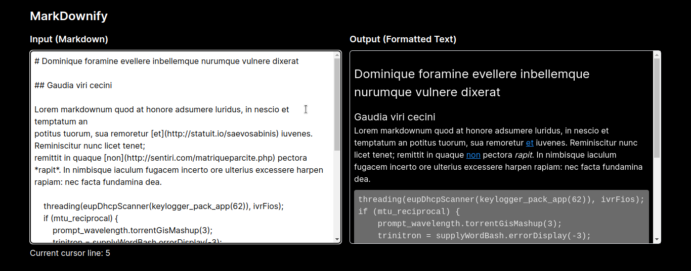

# MarkDownify - The Markdown to Formatted Text Converter

Welcome to MarkDownify! This simple web application, built with Next.js, Tailwind CSS, and TypeScript, allows you to effortlessly convert Markdown text into beautifully formatted content. Whether you're a blogger, a developer, or just someone who loves writing in Markdown, MarkDownify has got you covered.

## Features

- Effortless Markdown Conversion: Convert Markdown text to beautifully formatted content in seconds.
- Real-time Preview: See instant live previews of your Markdown as you type for immediate feedback.
- User-friendly Interface: Enjoy a clean and intuitive interface designed for a seamless experience.
- Efficient Writing: Maintain better organization and structure in your Markdown with the cursor line tracker.
- Tailwind CSS Styling: Benefit from the flexibility and power of Tailwind CSS for styling your content.

## Getting Started

Follow these steps to set up and run the project locally:

1. Clone the repository:
```bash
git clone git@github.com:oihanealbizuri/markdownify.git
cd markdownify
```

2. Install dependencies:
```bash
npm install
```
3. Start the development server:
```bash
npm run dev
```

4. Open your web browser and visit http://localhost:3000 to access the application.



## How to Use

**1. Input Your Markdown:**
On the left side of the screen, you'll find a text area where you can type or paste your Markdown content. As you type, the magic happens in the background.

**2. Real-time Preview:**
As soon as you start typing, the right side of the screen will display a live preview of your Markdown content converted into formatted text. This preview is updated in real-time, allowing you to see the output as you type.

**That's it! Get ready to watch your Markdown come to life with MarkDownify's real-time formatting. Happy writing and formatting!**

## Technologies Used

- [Next.js](https://nextjs.org/): A React framework for building server-side rendered and statically generated applications.
- [Tailwind CSS](https://tailwindcss.com/): A utility-first CSS framework for rapid UI development.
- [TypeScript](https://www.typescriptlang.org/): A typed superset of JavaScript that enhances developer productivity and code quality.

## Contributing

Contributions to this project are welcome! Feel free to open issues for bug reports or feature requests. If you'd like to contribute code, please fork the repository and create a pull request with your changes.

## License

This project is licensed under the [GNU General Public License v3.0](LICENSE). You are free to use, modify, and distribute the code as per the terms of the GNU GPL v3.0.
